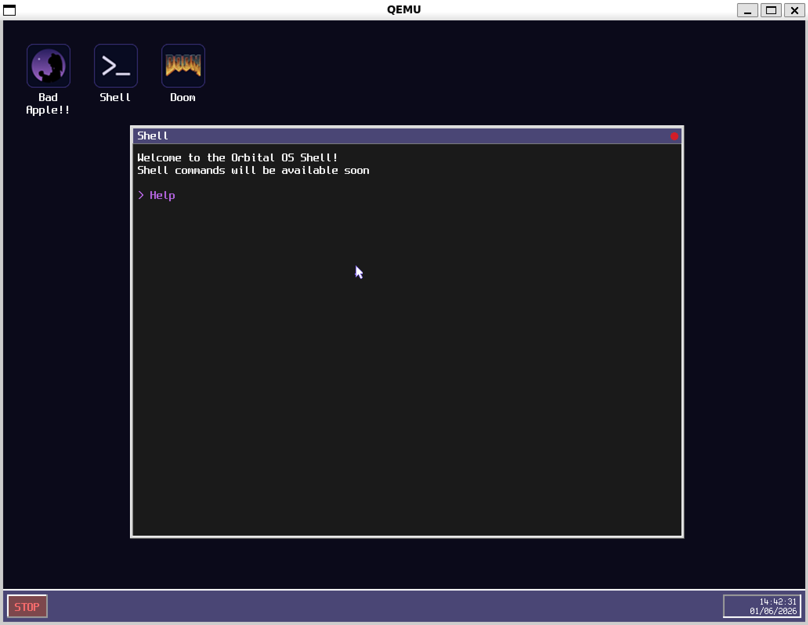

# OrbitalOS

A minimalist bare-metal OS written in Rust, featuring a custom bootloader, shell, and built-in applications.

> **Repo:** [github.com/CapyBlaze/OrbitalOS](https://github.com/CapyBlaze/OrbitalOS?utm_source=chatgpt.com)

---

## ⚡ Run without building

Don’t want to set up the full toolchain? Just download the `os.iso` from the latest release:

👉 **Releases → v0.1.0**
[GitHub Releases](https://github.com/CapyBlaze/OrbitalOS/releases/tag/v0.1.0?utm_source=chatgpt.com)

Then run it with QEMU:

```bash
qemu-system-x86_64 -drive format=raw,file=os.iso -serial stdio -vga std -display sdl,show-cursor=off
```

---

## Screenshots

<!-- Replace these with real screenshots once uploaded to GitHub -->

|             HUD & Desktop            |                 Bad Apple!!                 |
| :----------------------------------: | :-----------------------------------------: |
|      |  |
|                 Shell                |                                             |
|  |                                             |

---

## Build from source

### Requirements

* `nasm`
* `Rust` + `Cargo` (custom `x86_64-os` target)
* `rust-objcopy` (`cargo install cargo-binutils`)
* `qemu-system-x86_64`

---

### Build commands

```bash
# Full build (bootloader + kernel → os.iso)
make

# Run in QEMU
make run

# Run without rebuilding (if os.iso already exists)
make run-gui
```

---

### Generate assets

```bash
# Encode Bad Apple frames, compile fonts, convert icons
make tools
```

---

### Clean build artifacts

```bash
make clean
```
