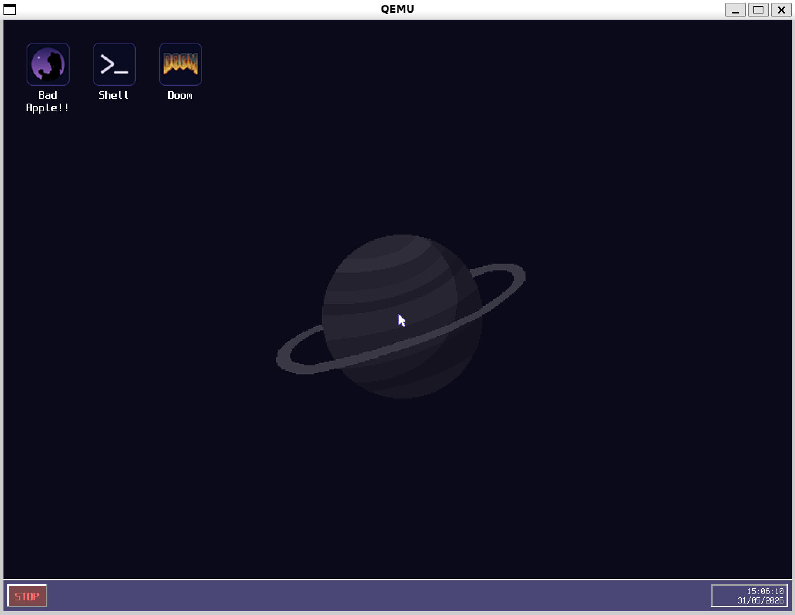
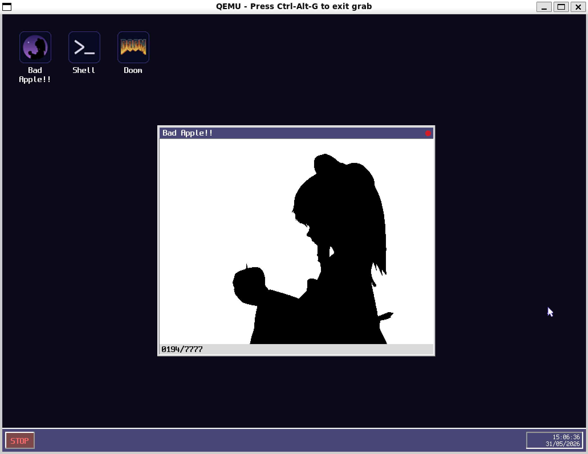

# OrbitalOS

Un OS minimaliste et bare-metal écrit en Rust, avec bootloader custom, shell, et apps intégrées.

> **Repo :** [github.com/CapyBlaze/OrbitalOS](https://github.com/CapyBlaze/OrbitalOS)

---

## ⚡ Tester sans compiler

Tu n'as pas envie de setup toute la toolchain ? Télécharge directement le `os.img` depuis la dernière release :

👉 **[Releases → v1.0.0](https://github.com/CapyBlaze/OrbitalOS/releases/tag/v0.1.0)**

Puis lance-le avec QEMU :

```bash
qemu-system-x86_64 -drive format=raw,file=os.img -serial stdio -vga std -display sdl,show-cursor=off
```

---

## Screenshots

<!-- Remplace ces lignes par tes vraies captures d'écran une fois uploadées sur GitHub -->

| HUD & Desktop | Bad Apple!! |
|:---:|:---:|
|  |  |

---

## Build depuis les sources

### Prérequis

- `nasm`
- `rust` + `cargo` (target `x86_64-os` custom)
- `rust-objcopy` (`cargo install cargo-binutils`)
- `qemu-system-x86_64`

### Commandes

```bash
# Build complet (bootloader + kernel → os.img)
make

# Lancer dans QEMU
make run

# Lancer sans rebuild (si os.img existe déjà)
make run-gui
```

### Générer les ressources

```bash
# Encode les frames Bad Apple, compile les fonts, convertit les icônes
make tools
```

### Nettoyage

```bash
make clean
```
